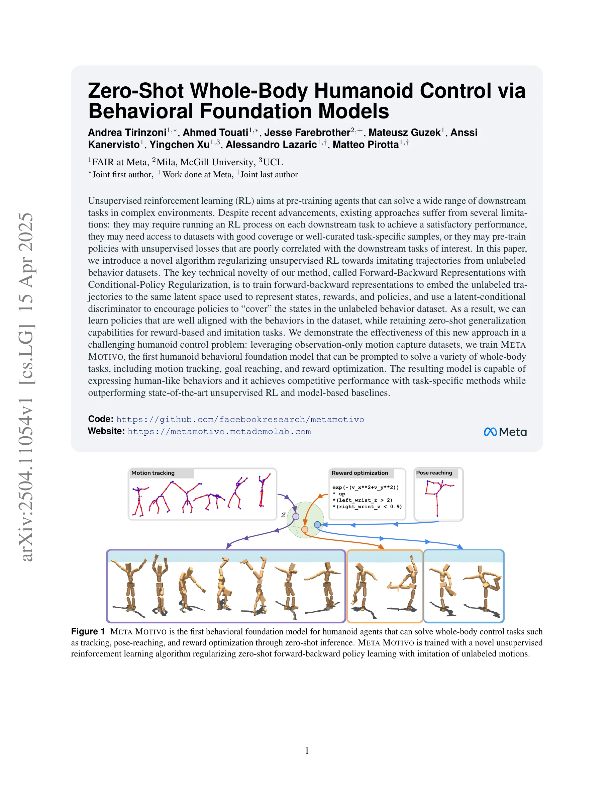
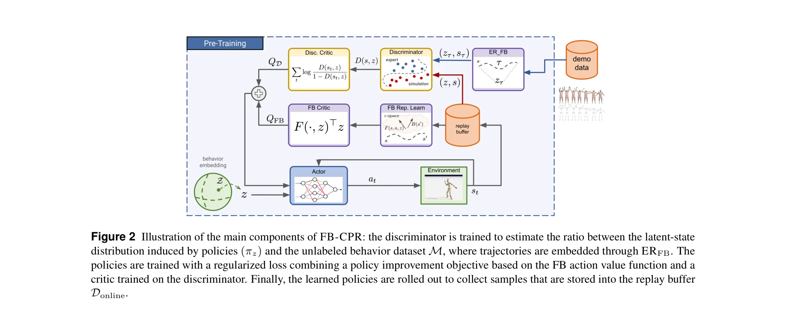

# Zero-Shot Whole-Body Humanoid Control via Behavioral Foundation Models

> **저자**: Andrea Tirinzoni, Ahmed Touati, Jesse Farebrother, Mateusz Guzek, Anssi Kanervisto, Yingchen Xu, Alessandro Lazaric, Matteo Pirotta | **날짜**: 2025-04-15 | **URL**: [https://arxiv.org/abs/2504.11054](https://arxiv.org/abs/2504.11054)

---

## Essence

*Figure 1 META MOTIVO is the first behavioral foundation model for humanoid agents that can solve whole-body control task*

본 논문은 unlabeled 행동 데이터셋으로 unsupervised RL을 정규화하여 zero-shot 전신 휴머노이드 제어를 가능하게 하는 FB-CPR 알고리즘과 이를 기반으로 한 첫 번째 휴머노이드 behavioral foundation model인 Meta Motivo를 제시한다.

## Motivation

- **Known**: Unsupervised RL과 behavior cloning은 각각 다운스트림 태스크 적응이나 일반화 측면에서 한계가 있으며, 최근 demonstration을 RL에 통합하는 방법들이 제안되고 있다.
- **Gap**: 기존 zero-shot RL은 unsupervised exploration 품질에 의존하고 unsupervised loss가 실제 태스크와 상관관계가 낮은 반면, behavior cloning은 데이터셋의 행동만 재현하고 새로운 태스크 일반화에 실패한다.
- **Why**: 휴머노이드 전신 제어는 높은 차원성과 내재적 불안정성으로 인한 도전적인 문제이며, 이를 해결할 수 있는 behavioral foundation model은 로보틱스, 가상 아바타, NPC 등 다양한 응용에 중요하다.
- **Approach**: Forward-Backward representations를 사용하여 unlabeled trajectory와 policy를 동일한 latent space에 임베딩하고, latent-conditional discriminator를 통해 policy가 데이터셋의 상태를 '커버'하도록 정규화한다.

## Achievement

*Figure 1 META MOTIVO is the first behavioral foundation model for humanoid agents that can solve whole-body control task*

- **FB-CPR 알고리즘**: Forward-Backward 표현을 unlabeled 행동 모방으로 정규화하여 zero-shot 일반화 능력을 유지하면서 데이터셋과 정렬된 정책 학습을 가능하게 함
- **Meta Motivo 모델**: AMASS motion capture 데이터로 사전학습된 첫 번째 휴머노이드 behavioral foundation model로, motion tracking, goal reaching, reward optimization을 zero-shot으로 해결
- **인간다운 행동**: SMPL 기반 휴머노이드에서 표현된 행동이 인간다운 특성을 보이며 task-specific 메서드와 경쟁력 있는 성능 달성
- **일반화 우수성**: State-of-the-art unsupervised RL 및 model-based baseline을 능가하는 성능

## How

*Figure 2 Illustration of the main components of FB-CPR: the discriminator is trained to estimate the ratio between the l*

- Successor measure의 low-rank decomposition을 이용한 FB 표현으로 상태-액션 진화를 모델링
- Unlabeled trajectory를 forward-backward embedding으로 같은 latent space에 임베딩
- Latent-conditional discriminator를 학습하여 정책이 데이터셋의 상태 분포를 커버하도록 장려
- Task 인코딩 벡터 z로 조건화된 다중 정책 πz 학습
- Temporal difference loss (Bellman residual)와 discriminator 손실의 결합
- Actor network를 통한 continuous action space에서의 arg max 근사

## Originality

- Unlabeled behavior 데이터로 unsupervised RL을 직접 정규화하는 새로운 접근법으로, behavior cloning의 제한성과 unsupervised RL의 탐험 문제를 동시에 해결
- FB 표현 프레임워크를 observation-only trajectory 모방에 확장한 첫 시도
- Latent-conditional discriminator를 통한 상태 커버리지 정규화 메커니즘의 창의적 설계
- 높은 차원 휴머노이드 제어에 zero-shot RL 방법을 성공적으로 적용한 첫 사례

## Limitation & Further Study

- AMASS와 같은 대규모 고품질 unlabeled 행동 데이터셋의 가용성에 의존하며, 다른 도메인에서의 적용 가능성 불명확
- Latent-conditional discriminator의 설계 선택이 empirical하며, 이론적 정당성에 대한 깊이 있는 분석 부족
- Proprioceptive observation만 고려하며, visual input이 포함된 더 현실적인 설정에 대한 확장 미흡
- Zero-shot 성능이 task-specific 메서드와 '경쟁력 있는' 수준으로, 완전히 우월하지는 않음", '후속 연구로 다양한 skeleton 구조나 로봇 형태로의 전이 학습, visual observation 통합, 더 강력한 실시간 적응 메커니즘 필요

## Evaluation

- Novelty: 4/5
- Technical Soundness: 3/5
- Significance: 4/5
- Clarity: 4/5
- Overall: 4/5

**총평**: 본 논문은 behavioral foundation model을 위한 새로운 정규화 프레임워크를 제시하며, 도전적인 휴머노이드 제어 문제에서 zero-shot 일반화 능력과 데이터 기반 행동 정렬을 효과적으로 결합한 의미 있는 기여를 한다.