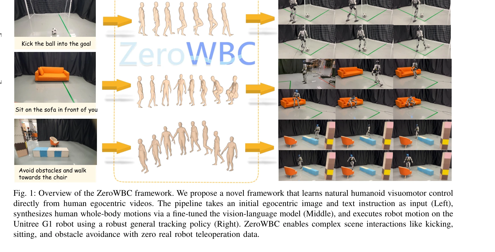
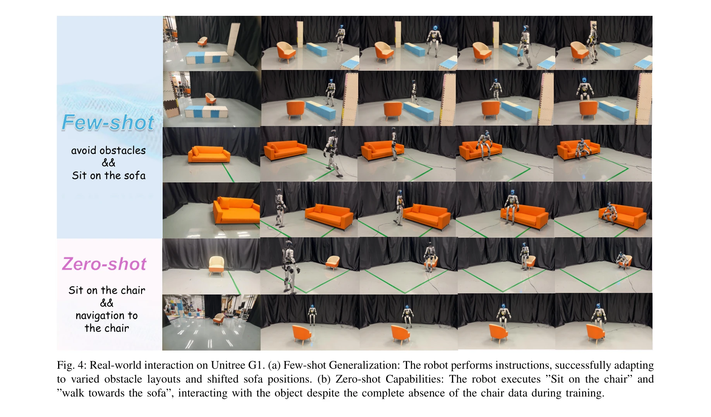
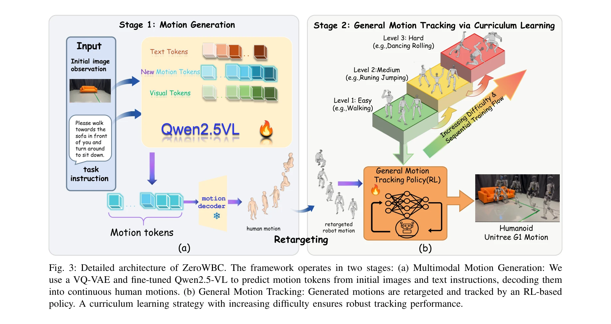

# ZeroWBC: Learning Natural Visuomotor Humanoid Control Directly from Human Egocentric Video

> **저자**: Haoran Yang, Jiacheng Bao, Yucheng Xin, Haoming Song, Yuyang Tian, Bin Zhao, Dong Wang, Xuelong Li | **날짜**: 2026-03-10 | **DOI**: [10.48550/arXiv.2603.09170](https://doi.org/10.48550/arXiv.2603.09170)

---

## Essence

*Fig. 1: Overview of the ZeroWBC framework. We propose a novel framework that learns natural humanoid visuomotor control*

ZeroWBC는 인간의 이중 시점 비디오와 모션 캡처 데이터로부터 휴머노이드 로봇의 자연스러운 전신 제어 정책을 학습하는 프레임워크로, 로봇 원격 조작 데이터 수집 없이 다양한 장면 상호작용을 가능하게 한다.

## Motivation

- **Known**: VLM 기반 모션 생성과 모션 추적 기술이 각각 발전했으며, 텍스트 조건부 인간 모션 생성은 이미 성숙한 단계이다. 그러나 기존 휴머노이드 제어 방법은 원격 조작 데이터 수집의 높은 비용이나 시뮬레이션 기반의 시뮬-투-리얼 갭 문제를 가지고 있다.
- **Gap**: 이중 시점 비디오와 모션 캡처 데이터를 활용한 휴머노이드 제어 프레임워크가 부재하며, 실제 로봇 데이터 수집 비용을 제거하면서도 자연스럽고 다양한 장면 상호작용을 실현하는 방법이 미흡하다.
- **Why**: 휴머노이드 로봇의 상용화와 대중화를 위해 데이터 수집 비용을 획기적으로 감소시키고, 인간처럼 자연스러운 전신 운동을 실현하는 것이 필수적이다. 특히 앉기, 차기 등 복잡한 장면 상호작용 능력은 실제 응용에서 매우 중요하다.
- **Approach**: VQ-VAE로 인간 모션을 토큰화한 후 VLM을 미세조정하여 이중 시점 이미지와 텍스트 지시로부터 미래 인간 모션을 생성하고, 생성된 모션을 로봇 조인트로 재타겟팅한 뒤 사전학습된 general motion tracking policy로 실행하는 2단계 파이프라인을 제시한다.

## Achievement

*Fig. 4: Real-world interaction on Unitree G1. (a) Few-shot Generalization: The robot performs instructions, successfully*

- **첫 번째 이중 시점 비디오 기반 휴머노이드 제어 프레임워크**: 인간 이중 시점 비디오와 MoCap 데이터를 활용하여 원격 조작 데이터 수집 비용을 획기적으로 절감
- **통합 2단계 아키텍처**: 모션 생성(텍스트 지시 + 시각 문맥) 및 모션 추적의 통합으로 자연스러운 전신 제어 실현
- **다양한 장면 상호작용 능력**: Unitree G1 로봇에서 차기, 앉기, 장애물 회피 등 복잡한 작업 성공적 실행 및 높은 성공률 달성
- **우수한 일반화 성능**: 기존 baseline 대비 모션 자연성과 다용성에서 우수한 성능 입증 및 시뮬레이션과 실제 환경 모두에서 견고한 성능

## How

*Fig. 3: Detailed architecture of ZeroWBC. The framework operates in two stages: (a) Multimodal Motion Generation: We*

- VQ-VAE를 사용하여 연속적인 인간 모션을 이산적 모션 토큰으로 인코딩
- Vision-Language Model을 텍스트 지시와 이중 시점 이미지 입력에 대해 미세조정하여 미래 모션 토큰 시퀀스 생성
- 생성된 인간 모션을 기하학적 재타겟팅을 통해 Unitree G1 로봇의 조인트 공간으로 변환
- MoCap 데이터셋으로 사전학습된 general motion tracking policy를 사용하여 재타겟팅된 모션을 추적하고 로봇 제어 신호 생성
- 이중 시점 카메라 설정으로 인간과 로봇의 시각적 관점을 정렬하여 모션 일관성 보장

## Originality

- 인간 이중 시점 비디오와 MoCap 데이터의 조합을 활용한 최초의 휴머노이드 제어 프레임워크 제시
- 비용이 높은 로봇 원격 조작 없이 대규모 인간 데이터로 사전학습하는 새로운 패러다임 도입
- VLM 기반 모션 생성과 general motion tracking의 효과적인 결합으로 장면 기반 전신 제어 실현
- 기존 decoupled 전략(상체/하체 분리)과 달리 통합된 자연스러운 전신 제어 달성

## Limitation & Further Study

- 인간 이중 시점 비디오와 MoCap 데이터의 정렬 문제 및 도메인 차이가 최종 로봇 성능에 영향을 미칠 수 있음
- 재타겟팅 과정에서 인간 모션의 세부 특성 손실 가능성 및 로봇의 물리적 제약으로 인한 모션 왜곡
- 평가가 주로 하나의 로봇 플랫폼(Unitree G1)에 한정되어 다른 휴머노이드 로봇에 대한 일반화 검증 필요
- 복잡한 멀티태스크 장면이나 동적으로 변화하는 환경에서의 성능 평가 부재
- 후속 연구로 다양한 로봇 형태에 대한 일반화, 더욱 정교한 모션 재타겟팅 방법 개발, 실시간 환경 변화 적응 능력 강화 필요

## Evaluation

- Novelty: 4/5
- Technical Soundness: 3/5
- Significance: 4/5
- Clarity: 4/5
- Overall: 4/5

**총평**: ZeroWBC는 인간 이중 시점 비디오 데이터를 효과적으로 활용하여 비용이 높은 로봇 원격 조작 데이터 수집을 제거하면서도 자연스럽고 다양한 장면 상호작용을 실현하는 혁신적인 접근법을 제시한다. 휴머노이드 로봇의 실용화에 중요한 기여를 하는 강력한 논문이다.