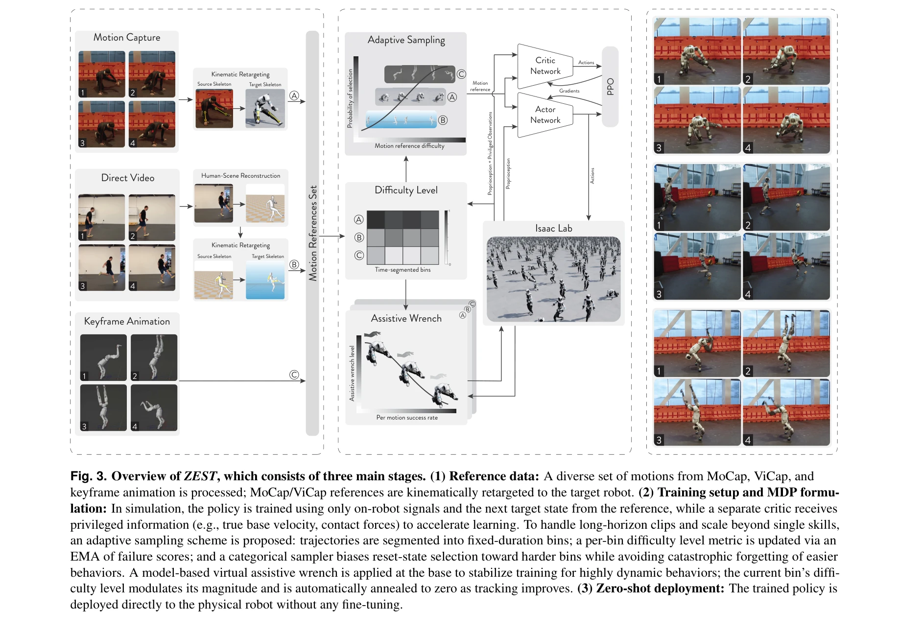
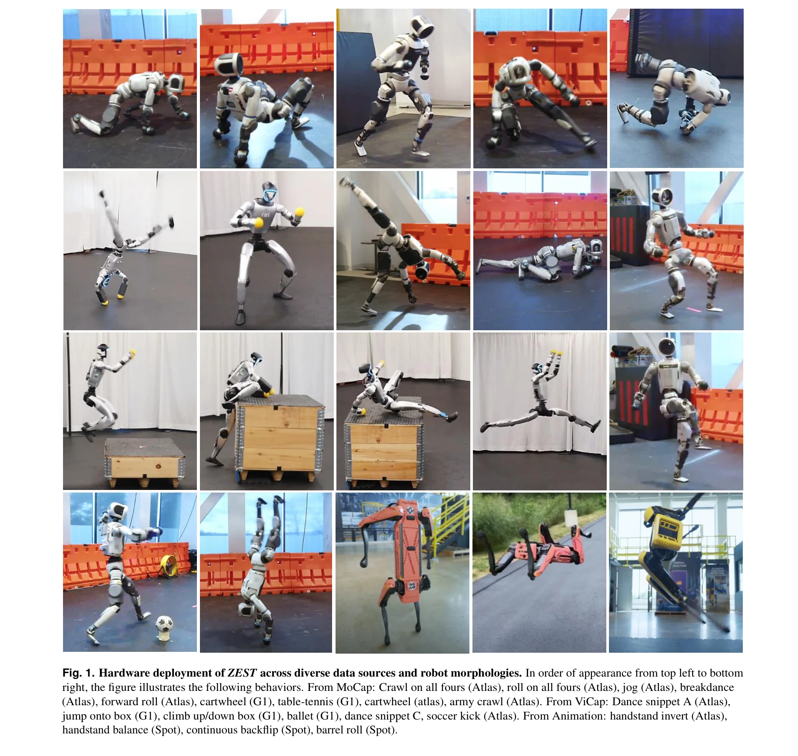

# ZEST: Zero-shot Embodied Skill Transfer for Athletic Robot Control

> **저자**: Jean Pierre Sleiman, He Li, Alphonsus Adu-Bredu, Robin Deits, Arun Kumar, Kevin Bergamin, Mohak Bhardwaj, Scott Biddlestone, Nicola Burger, Matthew A. Estrada, Francesco Iacobelli, Twan Koolen, Alexander Lambert, Erica Lin, M. Eva Mungai, Zach Nobles, Shane Rozen-Levy, Yuyao Shi, Jiashun Wang, Jakob Welner, Fangzhou Yu, Mike Zhang, Alfred Rizzi, Jessica Hodgins, Sylvain Bertrand, Yeuhi Abe, Scott Kuindersma, Farbod Farshidian | **날짜**: 2026-01-30 | **DOI**: [10.48550/arXiv.2602.00401](https://doi.org/10.48550/arXiv.2602.00401)

---

## Essence

*Fig. 3. Overview of ZEST, which consists of three main stages. (1) Reference data: A diverse set of motions from MoCap, *

ZEST는 motion capture, 비디오, 애니메이션 등 다양한 소스로부터 reinforcement learning을 통해 humanoid 및 quadruped 로봇의 동적 움직임을 학습하고 시뮬레이션 환경에서만 훈련하여 하드웨어에 zero-shot으로 배포하는 motion imitation 프레임워크이다.

## Motivation

- **Known**: 지난 10년간 legged robot의 다양한 동작 실현에는 offline trajectory optimization과 online tracking의 two-layer 아키텍처(MPC + optimization-based controller)가 널리 사용되어 왔으며, 최근에는 RL이 강력한 대안으로 등장하여 robust한 locomotion과 manipulation 성과를 보이고 있다.
- **Gap**: 기존 tabula rasa RL은 sample-inefficiency와 reward design 민감성이 높으며, model-based controller는 contact 라벨과 state estimator 의존성이 크고, 다양한 데이터 소스(MoCap, 비디오, 애니메이션)를 unified framework로 통합하여 zero-shot 배포하는 방법은 부족하다.
- **Why**: Humanoid 로봇이 인간 환경에서 효과적으로 작동하려면 다양한 동작을 일반화된 방식으로 수행해야 하며, 이는 per-skill engineering과 controller tuning의 brittle한 과정을 회피하고 scalable하게 여러 로봇 플랫폼에 배포 가능한 통합 제어 방식의 필요성을 보여준다.
- **Approach**: ZEST는 adaptive sampling으로 어려운 motion segment에 집중하고 model-based assistive wrench를 이용한 automatic curriculum을 적용하며, contact label과 reference window 없이 RL 정책을 학습한 후 joint-level gain 선택 절차와 refined actuator model을 통해 hardware zero-shot 배포를 실현한다.

## Achievement

*Fig. 1. Hardware deployment of ZEST across diverse data sources and robot morphologies. In order of appearance from top *

- **다양한 데이터 소스 통합**: Motion capture, monocular 비디오, 비물리 기반 애니메이션으로부터 동일한 RL 프레임워크로 정책 학습 가능
- **다중 로봇 플랫폼 확장**: Boston Dynamics Atlas, Unitree G1, Spot 등 서로 다른 형태의 humanoid/quadruped에 zero-shot 배포 성공
- **복잡한 동작 학습**: Army crawl, breakdancing, box-climbing, continuous backflip 등 동적 multi-contact skill과 acrobatic 동작 실현
- **엔지니어링 간소화**: Contact label, reference/observation window, state estimator, extensive reward shaping 제거로 개발 프로세스 단순화
- **Hardware robustness**: Moderate domain randomization만으로 sim-to-real transfer 실현

## How

*Fig. 3. Overview of ZEST, which consists of three main stages. (1) Reference data: A diverse set of motions from MoCap, *

- **Adaptive sampling**: 훈련 과정 중 어려운 motion segment에 대한 샘플링 강도를 동적으로 조정
- **Automatic curriculum learning**: Model-based assistive wrench를 활용하여 단계적 curriculum 구성으로 long-horizon maneuver 지원
- **Multi-source motion imitation**: Motion capture, video, animation 데이터를 통일된 imitation reward로 처리
- **Joint-level gain selection**: Closed-chain actuator의 approximate analytical armature value로부터 joint-level gain 자동 선택
- **Refined actuator modeling**: 실제 로봇 actuator의 특성을 개선된 모델로 반영
- **Domain randomization**: 시뮬레이션에서 moderate level의 randomization으로 sim-to-real gap 완화

## Originality

- **Heterogeneous data integration**: Motion capture, noisy video, non-physics animation을 단일 RL framework에서 처리하는 unified approach는 prior work의 single-source 제약을 극복
- **Contact-free imitation**: Contact label과 reference window 없이 motion imitation을 실현하여 데이터 수집 부담 감소
- **Automatic curriculum via model-based wrench**: Assistive wrench 기반 automatic curriculum은 manual curriculum 설계를 제거
- **Cross-morphology transfer**: 동일 정책이 humanoid에서 quadruped로 직접 전이되는 것은 기존 morphology-specific 접근과 차별화
- **Zero-shot deployment without per-task tuning**: Diverse skills를 fine-tuning 없이 하드웨어에서 직접 실행

## Limitation & Further Study

- **State estimation 요구사항**: 논문에서 state estimator를 제거했다고 주장하지만, 실제 배포 시 IMU, vision 등의 partial observability 처리 방식이 명확히 설명되지 않음
- **Domain randomization 한계**: Moderate domain randomization의 수준 정의가 모호하며, extreme sim-to-real scenario에서의 성능 한계 미언급
- **Contact dynamics 모델링**: Contact-rich 동작의 안정성이 implicit RL policy에만 의존하여, contact 제약 위반 또는 예측 불가능한 실패 위험 존재
- **데이터 의존성**: 고품질 motion capture나 정확한 비디오가 필수이며, 저품질 데이터에서의 robust성 평가 부족
- **후속 연구 방향**: Real-world task execution (manipulation, human interaction) 확장, 장시간 자율 운영 안정성 검증, 더 극단적인 환경 조건에서의 generalization 필요

## Evaluation

- Novelty: 4/5
- Technical Soundness: 4/5
- Significance: 4/5
- Clarity: 4/5
- Overall: 4/5

**총평**: ZEST는 heterogeneous 데이터 소스의 통합, contact label 제거, automatic curriculum, 다중 로봇 플랫폼으로의 zero-shot 배포라는 여러 중요한 혁신을 통해 robot locomotion과 motion imitation 분야의 실용적 한계를 크게 극복한 고도로 주목할 만한 연구이다. 실험 결과도 Atlas, G1, Spot의 복잡한 동작 성공으로 claimed 성과를 강력히 뒷받침한다.